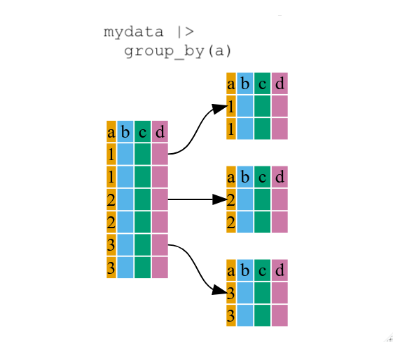
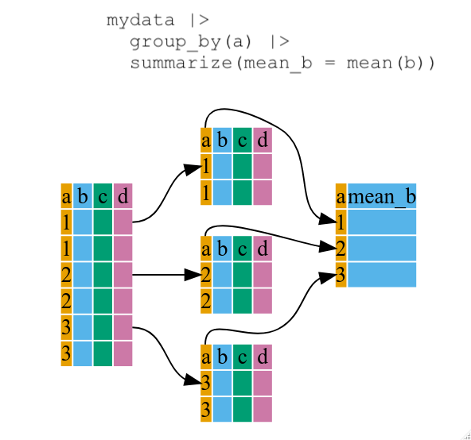

::::::::::::::::::::::::::::::::::::::: objectives

- To be able to use the six main data frame manipulation 'verbs' with pipes in  `dplyr`.
- To understand how `group_by()` and `summarize()` can be combined to summarize datasets.
- Be able to analyze a subset of data using logical filtering.

::::::::::::::::::::::::::::::::::::::::::::::::::

:::::::::::::::::::::::::::::::::::::::: questions

- How can I manipulate data frames without repeating myself?

::::::::::::::::::::::::::::::::::::::::::::::::::

In this episode we'll start to work with the penguins data directly. This is a version of the Palmer Penguins dataset that has been adapted for teaching. All missing values have been replaced with the sample mean / mode for convenience. The columns bill_length_mm and bill_depth_mm are defined as illustrated below. 

 ](fig/culmen_depth_ccby4_at_allison_horst.png){alt='Cartoon illustration of bill length and depth by @Allison Horst (CC-BY-4.0);'}


Manipulation of data frames means many things to many researchers: we often
select certain observations (rows) or variables (columns), we often group the
data by a certain variable(s), or we even calculate summary statistics. We can
do these operations using the normal base R operations:


``` error
Error in read_csv("data/penguins_teaching.csv", col_types = cols(year = col_character())): could not find function "read_csv"
```


``` r
mean(penguins$body_mass_g[penguins$species == "Adelie"])
```

``` error
Error: object 'penguins' not found
```

``` r
mean(penguins$body_mass_g[penguins$species == "Chinstrap"])
```

``` error
Error: object 'penguins' not found
```

``` r
mean(penguins$body_mass_g[penguins$species == "Gentoo"])
```

``` error
Error: object 'penguins' not found
```

But this isn't very *nice* because there is a fair bit of repetition. Repeating
yourself will cost you time, both now and later, and potentially introduce some
nasty bugs.

## The `dplyr` package

Luckily, the [`dplyr`](https://cran.r-project.org/package=dplyr)
package provides a number of very useful functions for manipulating data frames
in a way that will reduce the above repetition, reduce the probability of making
errors, and probably even save you some typing. As an added bonus, you might
even find the `dplyr` grammar easier to read.

:::::::::::::::::::::::::::::::::::::::::  callout

## Tip: Tidyverse

`dplyr` package belongs to a broader family of opinionated R packages
designed for data science called the "Tidyverse". These
packages are specifically designed to work harmoniously together.
Some of these packages will be covered along this course, but you can find more
complete information here: [https://www.tidyverse.org/](https://www.tidyverse.org/).

::::::::::::::::::::::::::::::::::::::::::::::::::

If you have have not installed the tidyverse package earlier, please do so:


``` r
install.packages('tidyverse')
```

Now let's load the package:


``` r
library("tidyverse")
```


Here we're going to cover 5 of the most commonly used `dplyr` functions as well as using
pipes (`|>`) to combine them.

1. `select()`
2. `filter()`
3. `group_by()`
4. `summarize()`
5. `mutate()`

But first we need to highlight some key differences between how base R and the tidyverse
handle tabular data.

Let's make a new script for this episode, by choosing the menu options _File_, _New File_, _R Script_.

One key thing to note is that the tidyverse duplicates many base R functions e.g.  
we can load our dataset using the tidyverse function `read_csv` rather than read.csv:


``` r
library(tidyverse)
penguins <- read_csv("data/penguins_teaching.csv", col_types = cols(year = col_character()))
penguins
```

``` output
# A tibble: 344 × 8
   species island    bill_length_mm bill_depth_mm flipper_length_mm body_mass_g
   <chr>   <chr>              <dbl>         <dbl>             <dbl>       <dbl>
 1 Adelie  Torgersen           39.1          18.7              181        3750 
 2 Adelie  Torgersen           39.5          17.4              186        3800 
 3 Adelie  Torgersen           40.3          18                195        3250 
 4 Adelie  Torgersen           43.9          17.2              201.       4202.
 5 Adelie  Torgersen           36.7          19.3              193        3450 
 6 Adelie  Torgersen           39.3          20.6              190        3650 
 7 Adelie  Torgersen           38.9          17.8              181        3625 
 8 Adelie  Torgersen           39.2          19.6              195        4675 
 9 Adelie  Torgersen           34.1          18.1              193        3475 
10 Adelie  Torgersen           42            20.2              190        4250 
# ℹ 334 more rows
# ℹ 2 more variables: sex <chr>, year <chr>
```

Notice that we specify that the year column should be loaded as text (character
data type). We do this because as the dataset only contains three year's worth of data we want to treat "year" as a categorical variable. It is helpful when plotting to store this categorical variable as text. 

We can see that penguins consists of a 344 by 8 `tibble`. We see the variable names, and an abbreviation  indicating what type of data is stored in each variable.

A tibble is a way of storing tabular data - a modern version of data frames, which is part of the tidyverse. 
Tibbles can for the most part, be treated like a `data.frame`.

::::::::::: callout 
R's standard data structure for tabular data is the `data.frame`.  In
contrast, `read_csv()` creates a `tibble` (also referred to, for historic
reasons, as a `tbl_df`).  This extends the functionality of  a `data.frame`,
and can, for the most part, be treated like a `data.frame`.
 
You may find that some older functions don't work on tibbles.   A tibble
can be converted to a dataframe using `as.data.frame(mytibble)`.  To convert
a data frame to a tibble, use `as.tibble(mydataframe)`.
 
Tibbles behave more consistently than data frames when subsetting with `[]`; 
this will always return another tibble.  This isn't the case when working with  data.frames.  You can find out more about the differences  between data.frames and 
tibbles by typing `vignette("tibble")`.
 
:::::::::::

## Using select()

If, for example, we wanted to move forward with only a few of the variables in
our data frame we could use the `select()` function. This will keep only the
variables you select.


``` r
year_island_bmg <- select(penguins, year, island, body_mass_g)
head(year_island_bmg)
```

``` output
# A tibble: 6 × 3
  year  island    body_mass_g
  <chr> <chr>           <dbl>
1 2007  Torgersen       3750 
2 2007  Torgersen       3800 
3 2007  Torgersen       3250 
4 2007  Torgersen       4202.
5 2007  Torgersen       3450 
6 2007  Torgersen       3650 
```

{alt='Diagram illustrating use of select function to select two columns of a data frame'}

If we open up `year_island_bmg` we'll see that it only contains the year,
island and body mass (g).  

Note that we can also use select to remove columns we don't want in our dataset:


``` r
noyear_noisland_nobmg <- select(penguins, -year, -island, -body_mass_g)
head(noyear_noisland_nobmg)
```

``` output
# A tibble: 6 × 5
  species bill_length_mm bill_depth_mm flipper_length_mm sex   
  <chr>            <dbl>         <dbl>             <dbl> <chr> 
1 Adelie            39.1          18.7              181  male  
2 Adelie            39.5          17.4              186  female
3 Adelie            40.3          18                195  female
4 Adelie            43.9          17.2              201. male  
5 Adelie            36.7          19.3              193  female
6 Adelie            39.3          20.6              190  male  
```


Above we used 'normal' grammar, but the strengths of
`dplyr` lie in combining several functions using pipes. Since the pipes grammar
is unlike anything we've seen in R before, let's repeat what we've done above
using pipes.


``` r
# before: year_island_bmg <- select(penguins, year, island, body_mass_g)
year_island_bmg <- penguins |> select(year, island, body_mass_g)
head(year_island_bmg)
```

``` output
# A tibble: 6 × 3
  year  island    body_mass_g
  <chr> <chr>           <dbl>
1 2007  Torgersen       3750 
2 2007  Torgersen       3800 
3 2007  Torgersen       3250 
4 2007  Torgersen       4202.
5 2007  Torgersen       3450 
6 2007  Torgersen       3650 
```

To help you understand why we wrote that in that way, let's walk through it step
by step. First we summon the penguins data frame and pass it on, using the pipe
symbol `|>`, to the next step, which is the `select()` function. In this case
we don't specify which data object we use in the `select()` function since it
gets that from the previous pipe. **Fun Fact**: There is a good chance you have
encountered pipes before in the shell. In R, a pipe symbol is `|>` while in the
shell it is `|` but the concept is the same!


:::::::::::::::::::::::::::::::::::::::::  callout

## Tip: Renaming data frame columns in dplyr

In Chapter 4 we covered how you can rename columns with base R by assigning a value to the output of the `names()` function.
Just like select, this is a bit cumbersome, but thankfully dplyr has a `rename()` function.

Within a pipeline, the syntax is `rename(new_name = old_name)`.
For example, we may want to rename the island column name from our `select()` statement above.


``` r
tidy_bmg <- year_island_bmg |> rename(island_name = island)

head(tidy_bmg)
```

``` output
# A tibble: 6 × 3
  year  island_name body_mass_g
  <chr> <chr>             <dbl>
1 2007  Torgersen         3750 
2 2007  Torgersen         3800 
3 2007  Torgersen         3250 
4 2007  Torgersen         4202.
5 2007  Torgersen         3450 
6 2007  Torgersen         3650 
```

::::::::::::::::::::::::::::::::::::::::::::::::::

## Using filter()

If we now want to move forward with the above, but only with observations for the
island of "Dream", we can combine `select` and `filter`


``` r
dream_year_island_bmg <- penguins |>
    filter(island == "Dream") |>
    select(year, body_mass_g)
head(dream_year_island_bmg)
```

``` output
# A tibble: 6 × 2
  year  body_mass_g
  <chr>       <dbl>
1 2007         3250
2 2007         3900
3 2007         3300
4 2007         3900
5 2007         3325
6 2007         4150
```
Notice how this code is indented and formatted over multiple lines to improve readability.


 ](fig/filter_ccby4_artwork_by_at_allison_horst.png){alt='Cartoon showing three fuzzy monsters either selecting or crossing out rows of a data table. If the type of animal in the table is “otter” and the site is “bay”, a monster is drawing a purple rectangle around the row. If those conditions are not met, another monster is putting a line through the column indicating it will be excluded. Stylized text reads "dplyr::filter() - keep rows that satisfy your conditions."'}

If we now want to show body mass of penguin species on Dream island but only
for a specific year (e.g., 2007), we can do as below.


``` r
dream_island_2007 <- penguins |>
  filter(island == "Dream", year == "2007") |> 
  select(species, body_mass_g)

head(dream_island_2007)
```

``` output
# A tibble: 6 × 2
  species body_mass_g
  <chr>         <dbl>
1 Adelie         3250
2 Adelie         3900
3 Adelie         3300
4 Adelie         3900
5 Adelie         3325
6 Adelie         4150
```

Notice that 2007 is in quotes ("2007") as the year column is stored as text (character datatype).

As with last time, first we pass the penguins data frame to the `filter()`
function, then we pass the filtered version of the penguins data frame to the
`select()` function. **Note:** The order of operations is very important in this
case. If we used 'select' first, filter would not be able to find the variable
`island` since we would have removed it in the previous step.

## Using group\_by()

Now, we were supposed to be reducing the error prone repetitiveness of what can
be done with base R, but up to now we haven't done that since we would have to
repeat the above for each island Instead of `filter()`, which will only pass
observations that meet your criteria (in the above: `island=="Dream"`), we
can use `group_by()`, which will essentially use every unique criteria that you
could have used in filter.


``` r
str(penguins)
```

``` output
spc_tbl_ [344 × 8] (S3: spec_tbl_df/tbl_df/tbl/data.frame)
 $ species          : chr [1:344] "Adelie" "Adelie" "Adelie" "Adelie" ...
 $ island           : chr [1:344] "Torgersen" "Torgersen" "Torgersen" "Torgersen" ...
 $ bill_length_mm   : num [1:344] 39.1 39.5 40.3 43.9 36.7 ...
 $ bill_depth_mm    : num [1:344] 18.7 17.4 18 17.2 19.3 ...
 $ flipper_length_mm: num [1:344] 181 186 195 201 193 ...
 $ body_mass_g      : num [1:344] 3750 3800 3250 4202 3450 ...
 $ sex              : chr [1:344] "male" "female" "female" "male" ...
 $ year             : chr [1:344] "2007" "2007" "2007" "2007" ...
 - attr(*, "spec")=
  .. cols(
  ..   species = col_character(),
  ..   island = col_character(),
  ..   bill_length_mm = col_double(),
  ..   bill_depth_mm = col_double(),
  ..   flipper_length_mm = col_double(),
  ..   body_mass_g = col_double(),
  ..   sex = col_character(),
  ..   year = col_character()
  .. )
 - attr(*, "problems")=<externalptr> 
```

``` r
str(penguins |> group_by(island))
```

``` output
gropd_df [344 × 8] (S3: grouped_df/tbl_df/tbl/data.frame)
 $ species          : chr [1:344] "Adelie" "Adelie" "Adelie" "Adelie" ...
 $ island           : chr [1:344] "Torgersen" "Torgersen" "Torgersen" "Torgersen" ...
 $ bill_length_mm   : num [1:344] 39.1 39.5 40.3 43.9 36.7 ...
 $ bill_depth_mm    : num [1:344] 18.7 17.4 18 17.2 19.3 ...
 $ flipper_length_mm: num [1:344] 181 186 195 201 193 ...
 $ body_mass_g      : num [1:344] 3750 3800 3250 4202 3450 ...
 $ sex              : chr [1:344] "male" "female" "female" "male" ...
 $ year             : chr [1:344] "2007" "2007" "2007" "2007" ...
 - attr(*, "spec")=
  .. cols(
  ..   species = col_character(),
  ..   island = col_character(),
  ..   bill_length_mm = col_double(),
  ..   bill_depth_mm = col_double(),
  ..   flipper_length_mm = col_double(),
  ..   body_mass_g = col_double(),
  ..   sex = col_character(),
  ..   year = col_character()
  .. )
 - attr(*, "problems")=<externalptr> 
 - attr(*, "groups")= tibble [3 × 2] (S3: tbl_df/tbl/data.frame)
  ..$ island: chr [1:3] "Biscoe" "Dream" "Torgersen"
  ..$ .rows : list<int> [1:3] 
  .. ..$ : int [1:168] 21 22 23 24 25 26 27 28 29 30 ...
  .. ..$ : int [1:124] 31 32 33 34 35 36 37 38 39 40 ...
  .. ..$ : int [1:52] 1 2 3 4 5 6 7 8 9 10 ...
  .. ..@ ptype: int(0) 
  ..- attr(*, ".drop")= logi TRUE
```

You will notice that the structure of the data frame where we used `group_by()`
(`grouped_df`) is not the same as the original `penguins` (`data.frame`). A
`grouped_df` can be thought of as a `list` where each item in the `list`is a
`data.frame` which contains only the rows that correspond to the a particular
value `island` (at least in the example above).

{alt='Diagram illustrating how the group by function oraganizes a data frame into groups'}

:::::::::::: callout
You may have noticed this output when using the group_by() function:

```
`summarise()` has grouped output by 'year'. You can override using the
`.groups` argument.
``` 

```
`summarise()` has grouped output by 'year'. 
``` 

- This indicates that the dataset we are working with was grouped by a variable 
(in this case, year) using a function like group_by(year) before applying summarise(). 

- The result of summarise() will maintain the grouping structure unless explicitly changed.
```
You can override using the `.groups` argument.
``` 

The .groups argument in summarise() lets you control how grouping is handled in the output. 
By default, summarise() keeps one level of grouping intact (i.e., the result remains grouped by any other grouping variables, if present). You can override this behaviour by specifying .groups explicitly. 

The possible values for .groups are:
- "drop_last" (default): Drops the last grouping variable (e.g., if grouped by year and month, it drops month but keeps year).
- "drop": Removes all grouping
- "keep": Keeps all grouping variables intact.
::::::::::::


## Using summarize()

The above was a bit on the uneventful side but `group_by()` is much more
exciting in conjunction with `summarize()`. This will allow us to create new
variable(s) by using functions that repeat for each of the group-specific
data frames. That is to say, using the `group_by()` function, we split our
original data frame into multiple pieces, then we can run functions
(e.g. `mean()` or `sd()`) within `summarize()`.


``` r
bm_byspecies <- penguins |>
    group_by(species) |>
    summarize(mean_body_mass_g = mean(body_mass_g))

head(bm_byspecies)
```

``` output
# A tibble: 3 × 2
  species   mean_body_mass_g
  <chr>                <dbl>
1 Adelie               3704.
2 Chinstrap            3733.
3 Gentoo               5069.
```

{alt='Diagram illustrating the use of group by and summarize together to create a new variable'}

That allowed us to calculate the mean body_mass_g for each species, but it gets
even better.


The function `group_by()` allows us to group by multiple variables. Let's group by `year` and `species`.


``` r
bm_byyear_byspecies <- penguins |>
    group_by(year, species) |>
    summarize(mean_body_mass_g = mean(body_mass_g))
```

``` output
`summarise()` has grouped output by 'year'. You can override using the
`.groups` argument.
```

``` r
head(bm_byyear_byspecies)
```

``` output
# A tibble: 6 × 3
# Groups:   year [2]
  year  species   mean_body_mass_g
  <chr> <chr>                <dbl>
1 2007  Adelie               3707.
2 2007  Chinstrap            3694.
3 2007  Gentoo               5071.
4 2008  Adelie               3742 
5 2008  Chinstrap            3800 
6 2008  Gentoo               5020.
```

That is already quite powerful, but it gets even better! You're not limited to defining 1 new variable in `summarize()`.


``` r
bm_byyear_byspecies <- penguins |>
    group_by(year, species) |>
    summarize(
      mean_body_mass_g = mean(body_mass_g),
      sd_body_mass_g = sd(body_mass_g)
    )
```

``` output
`summarise()` has grouped output by 'year'. You can override using the
`.groups` argument.
```

``` r
head(bm_byyear_byspecies)
```

``` output
# A tibble: 6 × 4
# Groups:   year [2]
  year  species   mean_body_mass_g sd_body_mass_g
  <chr> <chr>                <dbl>          <dbl>
1 2007  Adelie               3707.           451.
2 2007  Chinstrap            3694.           328.
3 2007  Gentoo               5071.           583.
4 2008  Adelie               3742            455.
5 2008  Chinstrap            3800            519.
6 2008  Gentoo               5020.           515.
```

## count() and n()

A very common operation is to count the number of observations for each
group. The `dplyr` package comes with two related functions that help with this.

For instance, if we wanted to check the number of penguins included in the
dataset for the year 2007, we can use the `count()` function. It takes the name
of one or more columns that contain the groups we are interested in, and we can
optionally sort the results in descending order by adding `sort=TRUE`:


``` r
penguins |>
    filter(year == "2007") |>
    count(island, sort = TRUE)
```

``` output
# A tibble: 3 × 2
  island        n
  <chr>     <int>
1 Dream        46
2 Biscoe       44
3 Torgersen    20
```

If we need to use the number of observations in calculations, the `n()` function
is useful. It will return the total number of observations in the current group rather than counting the number of observations in each group within a specific column. For instance, if we wanted to get the standard error of the body mass for penguins on each island:


``` r
penguins |>
    group_by(island) |>
    summarize(se_bm = sd(body_mass_g)/sqrt(n()))
```

``` output
# A tibble: 3 × 2
  island    se_bm
  <chr>     <dbl>
1 Biscoe     60.3
2 Dream      37.4
3 Torgersen  61.9
```

You can also chain together several summary operations; in this case calculating the `minimum`, `maximum`, `mean` and `se` of body_mass_g on each island:


``` r
penguins |>
    group_by(island) |>
    summarize(
      mean_bm = mean(body_mass_g),
      min_bm = min(body_mass_g),
      max_bm = max(body_mass_g),
      se_bm = sd(body_mass_g)/sqrt(n())
    )
```

``` output
# A tibble: 3 × 5
  island    mean_bm min_bm max_bm se_bm
  <chr>       <dbl>  <dbl>  <dbl> <dbl>
1 Biscoe      4713.   2850   6300  60.3
2 Dream       3713.   2700   4800  37.4
3 Torgersen   3716.   2900   4700  61.9
```

## Using mutate()

We can also create new variables prior to (or even after) summarizing information using `mutate()`.


``` r
bm_byyear_byisland_byspecies <- penguins |>
    mutate(body_mass_kg = body_mass_g/1000) |>
    group_by(year, island, species) |>
    summarize(
      mean_body_mass_kg = mean(body_mass_kg),
      sd_body_mass_kg = sd(body_mass_kg)
    )
```

``` output
`summarise()` has grouped output by 'year', 'island'. You can override using
the `.groups` argument.
```

``` r
head(bm_byyear_byisland_byspecies)
```

``` output
# A tibble: 6 × 5
# Groups:   year, island [4]
  year  island    species   mean_body_mass_kg sd_body_mass_kg
  <chr> <chr>     <chr>                 <dbl>           <dbl>
1 2007  Biscoe    Adelie                 3.62           0.292
2 2007  Biscoe    Gentoo                 5.07           0.583
3 2007  Dream     Adelie                 3.67           0.527
4 2007  Dream     Chinstrap              3.69           0.328
5 2007  Torgersen Adelie                 3.79           0.441
6 2008  Biscoe    Adelie                 3.63           0.478
```

](fig/mutate_ccby4_artwork_by_at_allison_horst.png){alt='Cartoon of cute fuzzy monsters dressed up as different X-men characters, working together to add a new column to an existing data frame. Stylized title text reads "dplyr::mutate - add columns, keep existing."'}

## Connect mutate with logical filtering: ifelse

When creating new variables, we can hook this with a logical condition. A simple combination of
`mutate()` and `ifelse()` facilitates filtering right where it is needed: in the moment of creating something new.
This easy-to-read statement is a fast and powerful way of discarding certain data (even though the overall dimension
of the data frame will not change) or for updating values depending on this given condition.


``` r
## keeping all data but "filtering" after a certain condition
# calculate bill length / depth ratio for only for Adelie penguins
bill_morph_adelie <- penguins |>
    mutate(
      bill_ratio = ifelse(
        species == "Adelie", 
        bill_length_mm/bill_depth_mm, 
        NA
      )
    )  
head(bill_morph_adelie)
```

``` output
# A tibble: 6 × 9
  species island    bill_length_mm bill_depth_mm flipper_length_mm body_mass_g
  <chr>   <chr>              <dbl>         <dbl>             <dbl>       <dbl>
1 Adelie  Torgersen           39.1          18.7              181        3750 
2 Adelie  Torgersen           39.5          17.4              186        3800 
3 Adelie  Torgersen           40.3          18                195        3250 
4 Adelie  Torgersen           43.9          17.2              201.       4202.
5 Adelie  Torgersen           36.7          19.3              193        3450 
6 Adelie  Torgersen           39.3          20.6              190        3650 
# ℹ 3 more variables: sex <chr>, year <chr>, bill_ratio <dbl>
```

:::::::::::::::::::::::::::::::::::::::  challenge

## Challenge 1

Write a single command (which can span multiple lines and includes pipes)
that will produce a data frame with the penguins found on Torgersen island,
including the columns species, body_mass_g, and year, but not for other islands.
How many rows does your data frame have, and why?

You should start from the `penguins` tibble.

:::::::::::::::  solution

## Solution to Challenge 1


``` r
penguins_torgersen <- penguins |>
  filter(island == "Torgersen") |>
  select(species, body_mass_g, year)

head(penguins_torgersen)
```

``` output
# A tibble: 6 × 3
  species body_mass_g year 
  <chr>         <dbl> <chr>
1 Adelie        3750  2007 
2 Adelie        3800  2007 
3 Adelie        3250  2007 
4 Adelie        4202. 2007 
5 Adelie        3450  2007 
6 Adelie        3650  2007 
```

Using `head(penguins_torgersen)` tells us that our output is "A tibble 52 x 3"
i.e. a tibble with 52 rows and 3 columns.

Alternative solutions to find the shape of the tibble:


``` r
dim(penguins_torgersen)
```

``` output
[1] 52  3
```

``` r
nrow(penguins_torgersen)
```

``` output
[1] 52
```

``` r
ncol(penguins_torgersen)
```

``` output
[1] 3
```
::::::::::::::: 

:::::::::::::::::::::::::::::::::::::::  


:::::::::::::::::::::::::::::::::::::::  challenge

## Challenge 2

Calculate the average flipper length per species.
Which species has the longest average flipper length, and which has the shortest?

You should start from the `penguins` tibble.

:::::::::::::::  solution

## Solution to Challenge 2


``` r
body_mass_by_species <- penguins |>
  group_by(species) |>
  summarize(mean_body_mass = mean(body_mass_g))

body_mass_by_species |>
  filter(mean_body_mass == min(mean_body_mass) | mean_body_mass == max(mean_body_mass))
```

``` output
# A tibble: 2 × 2
  species mean_body_mass
  <chr>            <dbl>
1 Adelie           3704.
2 Gentoo           5069.
```

Another way to do this is to use the `dplyr` function `arrange()`, which
arranges the rows in a data frame according to the order of one or more
variables from the data frame.  It has similar syntax to other functions from
the `dplyr` package. You can use `desc()` inside `arrange()` to sort in
descending order.


``` r
body_mass_by_species |>
  arrange(mean_body_mass) |>
  head(1)
```

``` output
# A tibble: 1 × 2
  species mean_body_mass
  <chr>            <dbl>
1 Adelie           3704.
```

``` r
body_mass_by_species |>
  arrange(desc(mean_body_mass)) |>
  head(1)
```

``` output
# A tibble: 1 × 2
  species mean_body_mass
  <chr>            <dbl>
1 Gentoo           5069.
```

Alphabetical order works too


``` r
body_mass_by_species |>
  arrange(desc(species)) |>
  head(1)
```

``` output
# A tibble: 1 × 2
  species mean_body_mass
  <chr>            <dbl>
1 Gentoo           5069.
```

:::::::::::::::::::::::::

::::::::::::::::::::::::::::::::::::::: 

  
:::::::::::::::::::::::::::::::::::::::  challenge

## Advanced Challenge

Calculate the average body mass in 2007 of 10 randomly selected penguins
for each species. Then arrange the species names in reverse alphabetical order.
**Hint:** Use the `dplyr` functions `arrange()` and `sample_n()`, they have
similar syntax to other dplyr functions.

:::::::::::::::  solution

## Solution to Advanced Challenge


``` r
body_mass_10penguins_byspecies <- penguins |>
  filter(year == "2007") |> 
  group_by(species) |>
  sample_n(10) |>
  summarize(mean_body_mass = mean(body_mass_g)) |>
  arrange(desc(species))

body_mass_10penguins_byspecies
```

``` output
# A tibble: 3 × 2
  species   mean_body_mass
  <chr>              <dbl>
1 Gentoo              5015
2 Chinstrap           3765
3 Adelie              3750
```

:::::::::::::::::::::::::

::::::::::::::::::::::::::::::::::::::::::::::::::


## Further reading
We recommend the following resources for some additional reading on the topic of this episode:

- [R for Data Science](https://r4ds.hadley.nz/) (online book)

- [Data Wrangling Cheat sheet](https://www.rstudio.com/wp-content/uploads/2015/02/data-wrangling-cheatsheet.pdf) (pdf file)

- [Introduction to dplyr](https://dplyr.tidyverse.org/) (online documentation)

- [Data wrangling with R and RStudio](https://www.rstudio.com/resources/webinars/data-wrangling-with-r-and-rstudio/) (online video)

- [Tidyverse Skills for Data Science](https://jhudatascience.org/tidyversecourse/) (online book)

:::::::::::::::::::::::::::::::::::::::: keypoints

- Use the `dplyr` package to manipulate data frames.
- Use `select()` to choose variables from a data frame.
- Use `filter()` to choose data based on values.
- Use `group_by()` and `summarize()` to work with subsets of data.
- Use `mutate()` to create new variables.

::::::::::::::::::::::::::::::::::::::::::::::::::


